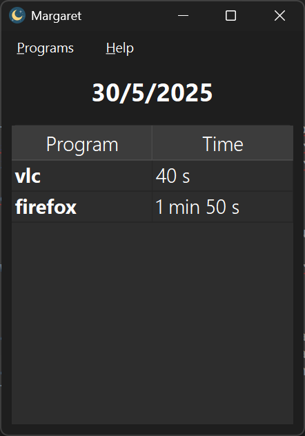

# Margaret

## English

Margaret is named after Margaret Hamilton (software engineer in charge of programming Apollo 11). It is a platform that seeks to improve the lives of all computer users by quantifying the hours per application, in order to better manage the time we spend between screens. Right now Margaret only quantifies the hours per application in Windows, but in the future it will be multiplatform and will support full synchronization between our devices.

The license chosen is the GPL v3.0 license.

## Español

Margaret recibe su nombre en honor a Margaret Hamilton (ingeniera de software encargada de la programación del Apollo 11).
Es una plataforma que busca mejorar la vida de todos los usuarios y usuarias de informática. ¿Cómo? Cuantificando las horas por aplicación, para así gestionar mejor el tiempo que pasamos entre pantallas. Ahora mismo Margaret solo cuantifica las horas por aplicación en Windows, pero en el futuro será multiplataforma y admitirá una total sincronización entre nuestros dispositivos.

La licencia escogida es la licencia GPL v3.0.
